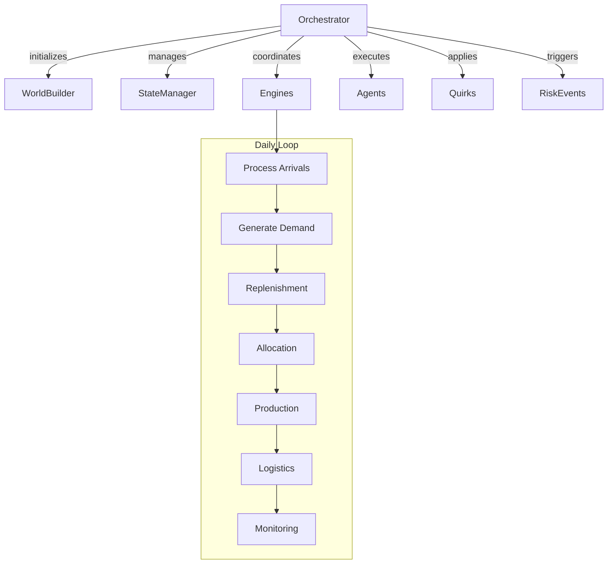
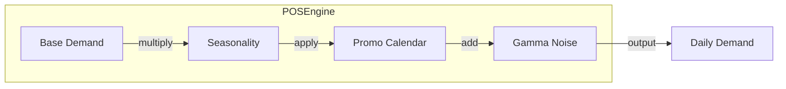
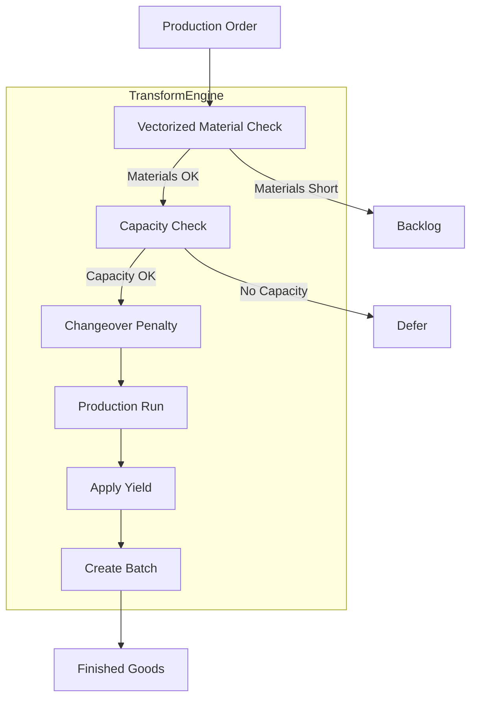
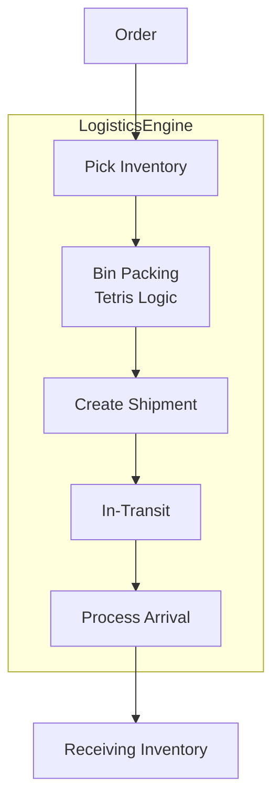
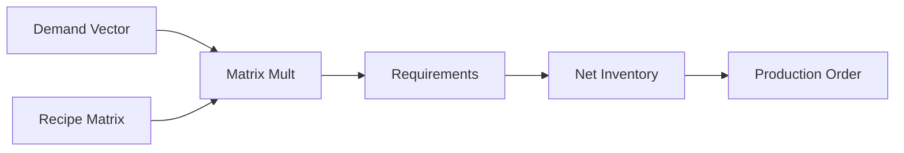
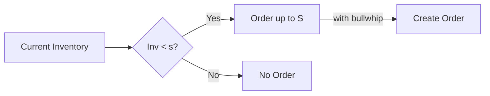
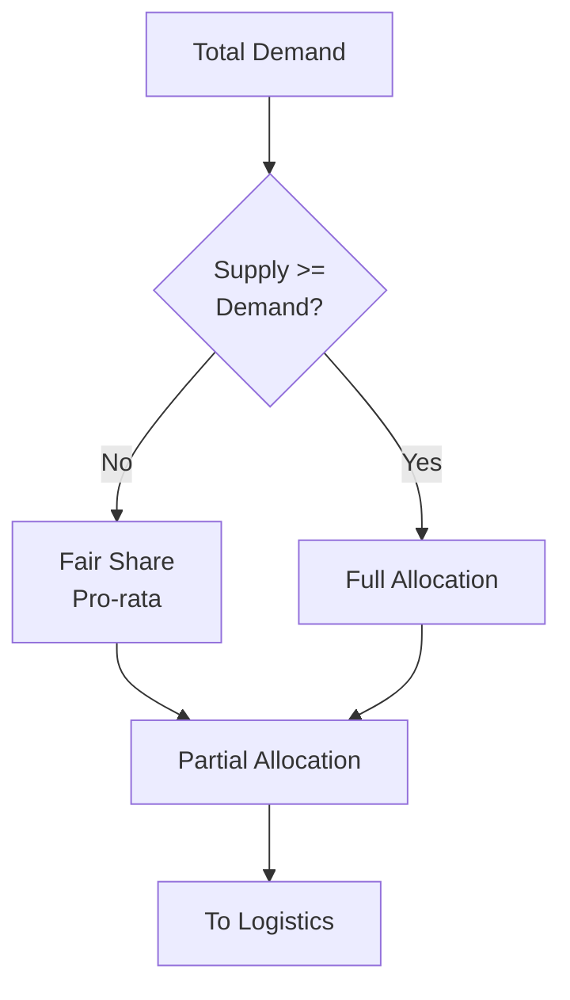
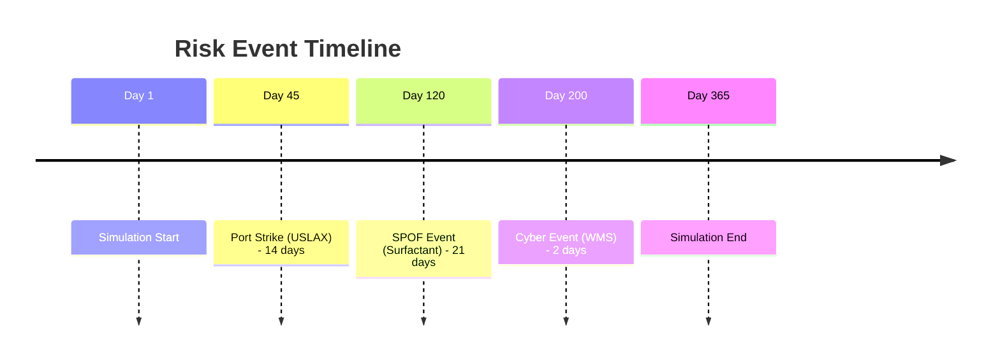
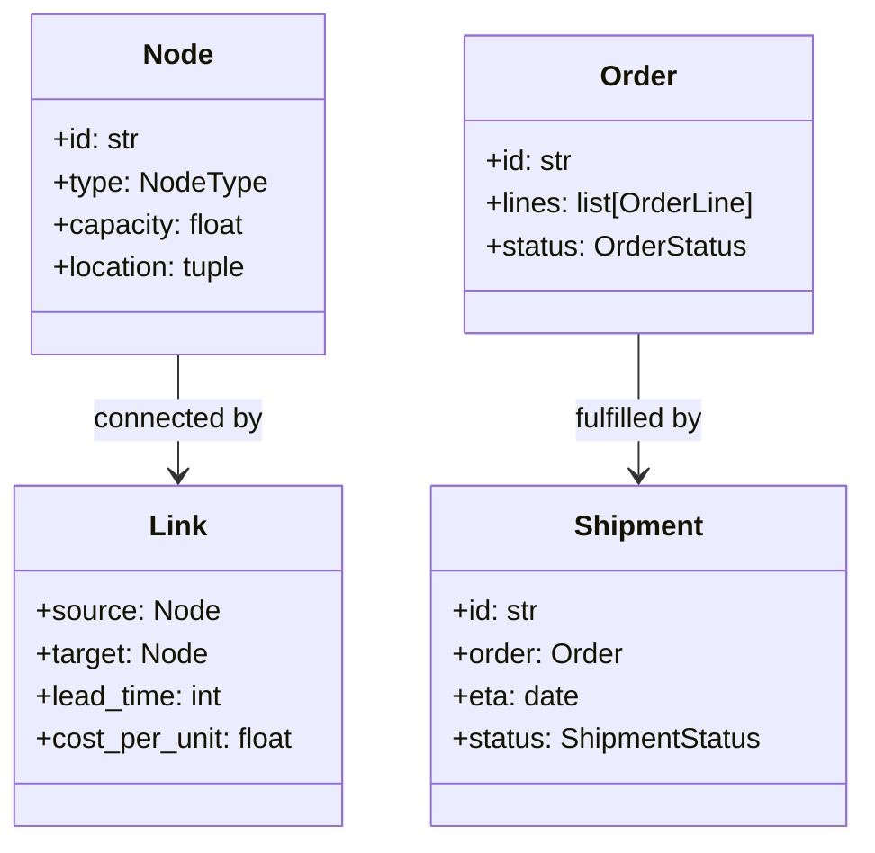
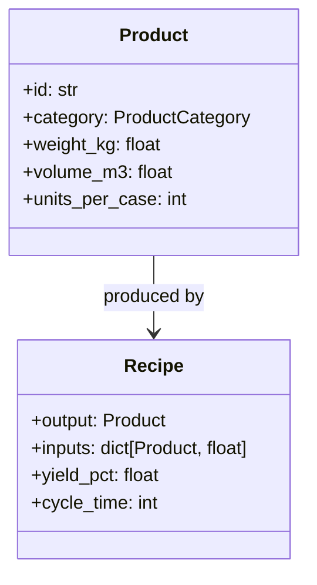

# Components Guide

This guide provides detailed documentation for each major component in the Prism Sim system.

## Simulation Engines

### Orchestrator

The central coordinator that manages the simulation time loop and sequences all engines.



**Key Responsibilities:**

- Initialize world from configuration
- Advance simulation time (daily steps)
- Coordinate engine execution order
- Track simulation metrics
- Generate output reports

**Location:** `src/prism_sim/simulation/orchestrator.py`

---

### POSEngine (Demand Generation)

Generates Point-of-Sale demand at retail locations with realistic patterns.



**Features:**

- Seasonal demand patterns (monthly multipliers)
- Promotional calendar with lift and hangover effects
- Stochastic noise via gamma distribution
- Per-SKU, per-location demand generation

**Location:** `src/prism_sim/simulation/demand.py`

---

### TransformEngine

Simulates production physics including capacity, changeovers, and yields using vectorized state updates.



**Features:**

- **Vectorized Checks:** Instant feasibility checks against inventory arrays.
- **Mass Balance:** Direct tensor updates for material consumption.
- **OEE-based Capacity:** Enforces finite capacity with efficiency loss.
- **Changeover Penalties:** Time lost when switching product families.
- **SPOF Tracking:** Simulates bottleneck ingredient shortages.

**Location:** `src/prism_sim/simulation/transform.py`

---

### LogisticsEngine

Handles shipment creation, routing, and delivery with physical constraints.



**Tetris Logic:**

The bin-packing algorithm respects physical constraints:

| Constraint | Description |
|------------|-------------|
| **Weight** | Truck max weight (e.g., 44,000 lbs) |
| **Volume** | Truck max cube (e.g., 2,800 cu ft) |
| **Pallet Limit** | Max pallets per truck |

Different products "fill" differently:

- **Bar Soap**: Weighs out (high density)
- **Toothpaste**: Cubes out (low density)
- **Liquid Detergent**: Mixed constraint

**Location:** `src/prism_sim/simulation/logistics.py`

---

### MRPEngine

Manufacturing Requirements Planning - converts demand into production orders using vectorized matrix algebra.



**Features:**

- **Vectorized MRP:** $O(1)$ calculation of ingredient needs using dense matrix multiplication.
- **Inventory Position:** Considers On-Hand, In-Transit, and WIP.
- **Fair Share:** Distributes aggregate demand across plants.
- **BOM Explosion:** Instant calculation of raw material needs for thousands of SKUs.
- **Tiered Inventory Policies:** Supports granular ROP/Target settings per product category (e.g., Commodities vs. Specialty).

**Location:** `src/prism_sim/simulation/mrp.py`

---

## Agent Layer

### MinMaxReplenisher

Implements (s,S) inventory policy with configurable thresholds.



**Policy Parameters:**

| Parameter | Description |
|-----------|-------------|
| `s` (reorder point) | Trigger level for ordering |
| `S` (order-up-to) | Target inventory level |
| `review_period` | Days between inventory checks |
| `bullwhip_factor` | Order amplification factor |

**Location:** `src/prism_sim/agents/replenishment.py`

---

### AllocationAgent

Allocates available inventory across competing demands using fair-share logic.



**Features:**

- Priority-based allocation
- Fair-share when supply constrained
- Channel balancing (Retail vs. DTC)
- **Capacity Constraints:** Respects finite supplier throughput limits.

**Location:** `src/prism_sim/agents/allocation.py`

---

## Behavioral Layer

### Quirks Engine

Injects realistic human and system behaviors that deviate from perfect rationality.

```mermaid
graph TD
    subgraph Quirks
        PC[Port Congestion<br/>AR(1) delays]
        OB[Optimism Bias<br/>Forecast inflation]
        PI[Phantom Inventory<br/>Shrinkage]
        BW[Bullwhip<br/>Order amplification]
    end

    SIM[Simulation State] --> PC
    PC --> OB
    OB --> PI
    PI --> BW
    BW --> ADJ[Adjusted State]
```

| Quirk | Description | Physics Impact |
|-------|-------------|----------------|
| **Port Congestion** | AR(1) auto-regressive delays | Increases lead time variability |
| **Optimism Bias** | Planners over-forecast new products | Creates excess inventory |
| **Phantom Inventory** | Undetected shrinkage with lag | Causes phantom stockouts |
| **Bullwhip Amplification** | Order batching and gaming | Increases upstream variance |

**Location:** `src/prism_sim/simulation/quirks.py`

---

### Risk Events

Deterministic disruption scenarios injected at specific simulation days.



**Configured Scenarios:**

| Scenario | Duration | Impact |
|----------|----------|--------|
| Port Strike | 14 days | West RDC supply disruption |
| SPOF Supplier | 21 days | Critical ingredient shortage |
| Cyber/WMS | 2 days | DTC fulfillment freeze |

**Location:** `src/prism_sim/simulation/risk_events.py`

---

## Core Infrastructure

### StateManager

Vectorized state storage with O(1) access patterns.

**Managed Tensors:**

| Tensor | Dimensions | Description |
|--------|------------|-------------|
| `inventory` | (nodes, products) | Current stock levels |
| `wip` | (nodes, products) | Work in process |
| `backorders` | (nodes, products) | Unfilled orders |
| `in_transit` | (shipments,) | Shipments en route |

**Location:** `src/prism_sim/simulation/state.py`

---

### RecipeMatrix

Dense matrix representation of Bills of Materials (BOM) for vectorized MRP.

**Structure:**

| Dimension | Description |
|-----------|-------------|
| **Rows ($i$)** | Output Product (Finished Good) |
| **Cols ($j$)** | Input Product (Ingredient) |
| **Value ($R_{ij}$)** | Quantity of $j$ required to make 1 unit of $i$ |

**Usage:**
Allows calculation of ingredient requirements via simple vector-matrix multiplication:
$$ \mathbf{req} = \mathbf{d} \cdot \mathbf{R} $$
Where $\mathbf{d}$ is the demand vector and $\mathbf{R}$ is the recipe matrix.

**Location:** `src/prism_sim/network/recipe_matrix.py`

---

### WorldBuilder

Constructs the simulation world from configuration.

**Build Sequence:**

1. Load configuration files
2. Create Product catalog (SKUs, recipes)
3. Build Network topology (nodes, links)
4. Initialize Agents with policies
5. Set initial inventory positions

**Location:** `src/prism_sim/simulation/builder.py`

---

### RealismMonitor

Validates simulation physics and tracks KPIs.

**Validation Checks:**

- **Mass Balance Audit:** Enforces the physical conservation law $I_t = I_{t-1} + \text{Inflows} - \text{Outflows}$. Detects inventory "leaks" or "magic creation" by comparing expected levels (based on recorded flows) against actual state tensors.
- **Little's Law compliance:** Ensures lead times and WIP align with flow rates.
- **Capacity constraint adherence:** Validates that production never exceeds theoretical plant limits.
- **Inventory positivity:** (Implicitly handled but audited) ensures physical reality is maintained.

**Tracked Metrics:**

- Service Level (LIFR)
- Fill rate, OTIF
- Inventory turns
- Truck fill rate
- OEE
- Cost-to-serve

**Location:** `src/prism_sim/simulation/monitor.py`

---

## Domain Models

### Network Primitives



**Location:** `src/prism_sim/network/core.py`

---

### Product Models



**Categories:**

- **Oral Care**: High value-density (cubes out)
- **Personal Wash**: High weight-density (weighs out)
- **Home Care**: Mixed constraint

**Location:** `src/prism_sim/product/core.py`
