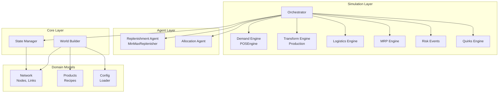
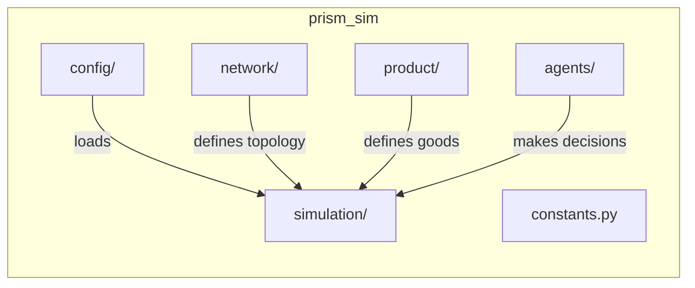
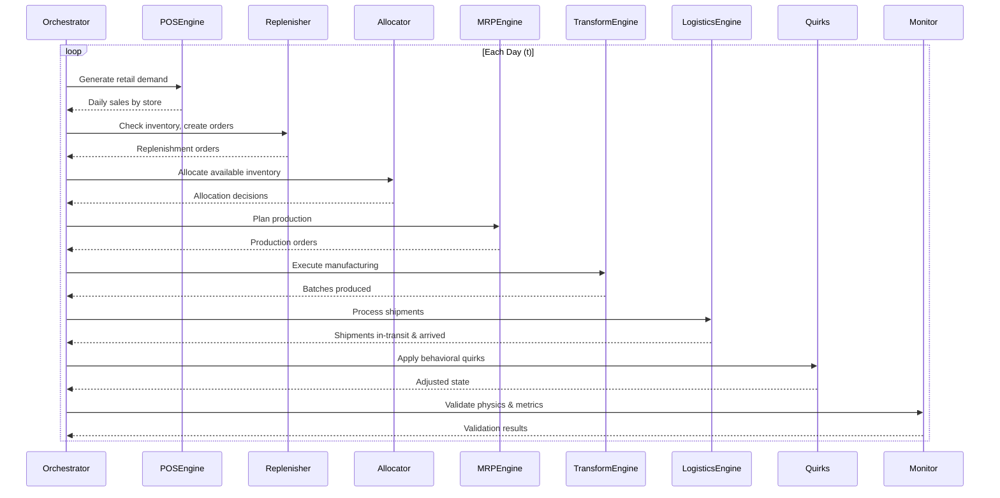
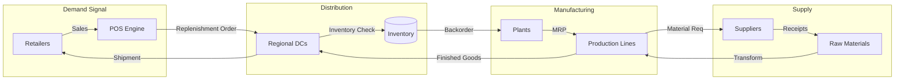
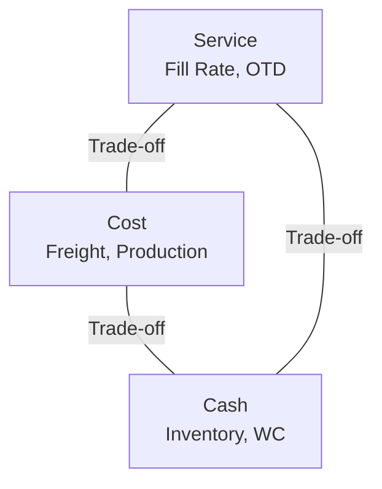

# Architecture Overview

Prism Sim is a **Discrete-Event Simulation (DES)** framework designed to generate high-fidelity supply chain data that adheres to the fundamental laws of Supply Chain Physics.

## System Architecture

The system follows a modular, layered architecture with clear separation of concerns:



## Package Structure



| Package | Responsibility |
|---------|---------------|
| `config/` | Configuration loading and validation |
| `network/` | Network topology primitives (Node, Link, Order, Shipment) |
| `product/` | Product definitions and recipes with weight/cube |
| `agents/` | Decision-making agents (replenishment, allocation) |
| `simulation/` | Core simulation engines and orchestration |
| `constants.py` | Shared constants and enumerations |

## Simulation Loop

The Orchestrator advances time daily, coordinating all engines in a specific sequence:



## Data Flow

Orders and inventory flow through the network following Supply Chain Physics:



## State Management

The simulation uses vectorized state management for performance:

```mermaid
graph TD
    subgraph StateManager
        IDX[ID-to-Index Mapping]
        INV[Inventory Tensor<br/>float64 array]
        WIP[WIP Tensor]
        BO[Backorder Tensor]
    end

    subgraph Operations
        READ[O(1) Read]
        WRITE[O(1) Write]
        BATCH[Vectorized Updates]
    end

    IDX --> READ
    IDX --> WRITE
    INV --> BATCH
    WIP --> BATCH
    BO --> BATCH
```

Key design principles:

- **O(1) Lookups**: Entity IDs map to integer indices for direct array access
- **Vectorized Operations**: NumPy arrays for bulk state transitions
- **Zero-Copy Views**: Data views passed between engines, not copies

## Physics Validation

The simulation continuously validates against Supply Chain Physics:

| Law | Implementation | Validation |
|-----|---------------|------------|
| **Little's Law** | $WIP = TH \times CT$ | Checked at each node |
| **Mass Balance** | $I_t = I_{t-1} + R_t - S_t$ | Inventory reconciliation |
| **VUT Equation** | Non-linear queue times | Congestion monitoring |
| **Capacity Limits** | Production capped at OEE | Transform engine |
| **Inventory Positivity** | Cannot ship negative | State manager guards |

## Key Concepts

### The Supply Chain Triangle

Every simulation decision impacts the balance between:



### Resilience Metrics

The simulation tracks system fragility:

- **Time-to-Survive (TTS)**: How long until stockout during disruption
- **Time-to-Recover (TTR)**: How long to restore full service

## Next Steps

- [Components Guide](components.md) - Deep dive into each module
- [API Reference](../reference/prism_sim/index.md) - Module documentation
- [Physics Theory](../planning/physics.md) - Theoretical foundations
